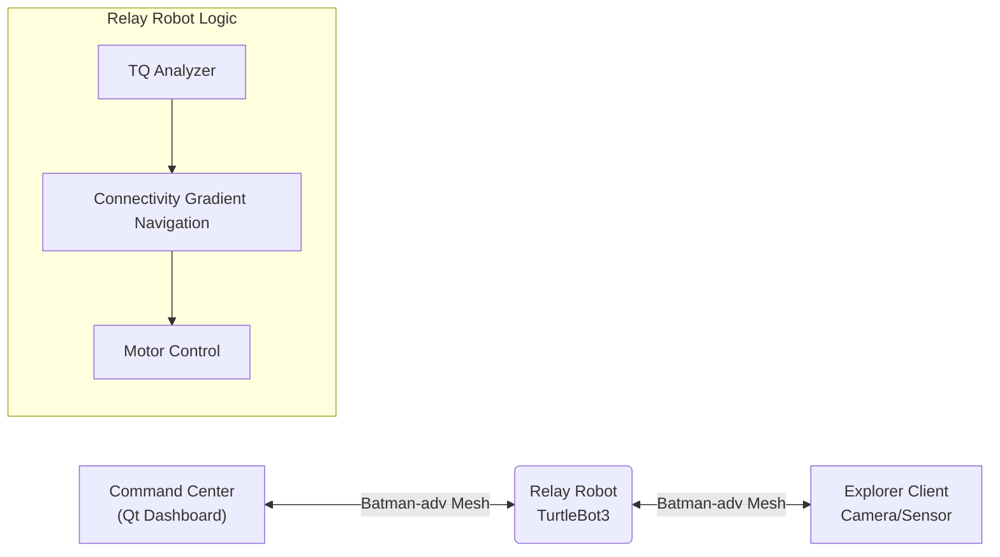

# RelayBot

## 1. 프로젝트 개요

재난 현장, 지하 통로, 터널과 같은 환경에서는 구조 인력의 이동에 따라  
기존 통신 인프라(LTE/5G)가 급격히 약화되거나 완전히 단절되는 문제가 반복적으로 발생합니다.  
고정형 중계기나 단순 신호 증폭 방식은 이러한 동적인 환경 변화에 효과적으로 대응하기 어렵습니다.

본 프로젝트는 이러한 한계를 해결하기 위해,  
통신 품질(TQ/RSSI)을 실시간으로 분석하고 **중계 로봇이 직접 이동하여  
통신 경로를 물리적으로 재구성하는 자율 이동형 메시 중계 시스템**을 제안합니다.

## 2. 시스템 구성도 및 아키텍쳐 
### 1. 시스템 구성도


시스템은 영상송신(Camera) -> 중계(Relay) -> 수신 및 관제(Host/QT App) 의 3단계로 동작
1) Body Cam (송신) : 구조 대원이나 로봇에 부착된 카메라가 현장 영상을 촬영하고, 이를 BATMAN-ADV 기반의 메쉬 네트워크를 통해 실시간으로 송출
2) Relay Bot (중계) : 통신 품질(TQ)을 실시간으로 분석하여 최적의 경로로 데이터를 중계하며, 링크 품질 저하 시 ROS2 기반 자율 주행을 통해 통신이 원활한 위치로 스스로 이동하여 네트워크를 복구
3) Control Center (수신/관제) : 중계된 영상과 네트워크 상태 정보는 최종적으로 Qt 기반의 관제 시스템에 수신되어, 사용자가 현장 상황을 실시간으로 모니터링 


### 2. 시스템 아키텍쳐


본 시스템은 **ROS 2**를 미들웨어로 사용하며, **Batman-adv** 커널 모듈을 통해 투명한(Transparent) 메시 네트워크를 형성합니다.



### 📂 디렉토리 구조 (Directory Structure)

```text
Intel-4th-Project
├── 📂 comm_pkg                   # Batman-adv 및 네트워크 상태 모니터링 모듈 (Non-ROS)
└── 📂 ros2_turtlebot_createdpkg  # ROS 2 핵심 패키지
    ├── 📂 relay_bot_pkg          # [Core] 통신 품질 기반 자율 주행 노드 (Nav2 미사용, 자체 알고리즘)
    └── 📂 robot_Qt               # [GUI] 관제 센터용 Qt 대시보드 어플리케이션

```


---
## 3. 주요 기능 
### 1. BATMAN-adv  Mesh Network 
- Layer-2 라우팅:  IP 충돌 없이 MAC 주소 기반으로 동작하여 기지국 범위가 바뀌어도 동일 IP 사용 가능
- TQ (Transmission Quality) 지표 활용: 단순 신호 세기(RSSI)가 아닌 실제 패킷 전송 성공률을 기반으로 경로를 설정하여 신뢰성 확보

- Self-Healing Network(자가치유 네트워크): 특정 노드와의 연결이 끊겨도 자동으로 다른 경로를 탐색하여 네트워크를 복구

- Why BATMAN-ADV?
  - 자가 치유 기능을 갖춘 L2 메시 라우팅
  - 노드 이동성 및 인프라 장애에 강인함
  - 재난 및 임시 네트워크에 적합


### 2. 통신 품질 기반 최적 위치 탐색이동


- RelayBoT이 실시간으로 통신 감도를 분석하고, 신호가 가장 강한 위치를 스스로 판단하여 이동
- 지도(Map)이 없는 낯선 환경에서도 오직 신호 세기만을 감지하여 중계 거점 확보

*지도 없는(Map-less) 자율 주행: SLAM을 이용한 복잡한 지도 생성 없이, 오직 통신 신호의 품질(TQ) 변화량(Gradient)만을 계산하여 이동
- **신호 추적 로직:**
    - `Signal ↑ (Good)`: 신호가 좋아지는 방향으로 계속 이동 (Keep Moving)
    - `Signal ↓ (Bad)`: 신호가 나빠지면 방향 전환 (Random Move/Probe)
    - `Signal ≥ Target`: 목표 품질 도달 시 정지 및 중계 모드 전환 (Stop & Relay)

- Why Gradient-based Navigation?
  - 위치 정확성이 아닌 커뮤니케이션 품질이 주요 목표
  - 사전 지도나 위치 확인이 필요 없음
  - 불안정한 환경에 적합한 가볍고 반응형 제어

### 3. 실시간 관제 시스템 GUI (Qt Application)


* 영상 스트리밍: Body Cam에서 전송되는 영상 실시간 모니터링
* Mesh 망 접속 상태 확인: Body Cam <-->  Control Center 통신 연결 상태 확인
* BATMAN-ADC Network Button: BATMAN-ADC Network 활성화 버튼
* TQ 신호 세기: 실시간 신호 품질 변화를 그래프로 시각화하여 로봇의 판단 근거 모니터링
* Device Info 시각화: 현재 연결된 노드들의 IP, MAC 주소 확인
---
## 4. 시연 영상


### Body Cam 복도를 지나서 코너를 돌아가면서 계단으로 들어가는 상황

**1. RelayBot 없는 상황**

https://github.com/user-attachments/assets/dbd73cf2-d1c9-4278-b079-711c15ac5dec

- 코너로 들어가면서 통신 링크가 급격히 떨어지면서 계단으로 진입 시 TQ값이 급격히 약화됨
- 영상 프레임 드롭 및 연결 불안정 발생

**2. RelayBot 있는 상황**


https://github.com/user-attachments/assets/57877833-89f8-40b0-a458-0ba9fd22433c


- 코너를 돌아가면서 통신 링크가 떨어지면서 RelayBot(중계기) 이동하며 중계 위치 확보
- Mesh Network가 재구성되며 통신 거리 및 링크 안전성 확장

---
## 5. 시행착오 및 해결방안
**[무선랜카드 드라이버 호환성 문제]**
* **현상:** 고성능 무선랜카드(ipTIME AX900UA)가 Mesh 모드(IBSS) 접속 설정을 지원하지 않아 네트워크 구성 실패
* **원인:** 제조사 제공 드라이버가 리눅스 커널의 Mesh 관련 표준을 완벽히 지원하지 않음
* **해결:** 드라이버 소스 수정을 시도했으나 안정성 확보를 위해 라즈베리파이 4 내장 와이파이(On-board WiFi)로 변경하여 호환성 문제 해결 및 안정적인 Mesh 망 구축

**[어플리케이션 강제 종료]**
* **현상:** 중계기가 Mesh에 연결되면 어플리케이션이 강제 종료되는 현상 발생
* **원인:**
    1. 패킷 손실로 인해 헤더 정보가 훼손되면서, 수신 데이터 값이 터무니없는 값으로 들어옴
    2. BATMAN-ADV 프로토콜 사용 시 발생하는 오버헤드에 대한 고려가 부족했음
* **해결:**
    1.  BATMAN-ADV 프로토콜의 헤더 크기를 고려하여 네트워크 MTU 사이즈 축소 설정.
    2. 수신 코드에 메모리 크기 검증 로직 추가

**[메쉬 네트워크 품질(TQ) 불안정 원인 분석]**
* **현상:** 중계기가 Mesh 접속 시 TQ 값이 급격히 변동되는 현상 발생
* **검증:**
     데이터 부하가 원인일 것"이라는 가설을 세우고 해상도별(144p~720p) 스트레스 테스트를 진행했으나 유의미한 상관관계가 없음을 확인
    
* **결론:**
    TQ 값 변동은 데이터 크기보다 주변 전파 간섭 및 물리적 환경에 더 민감하다는 결론을 도출

---

## 6. 프로젝트 결과

- Wi-Fi 신호가 닿지 않는 건물 내 복도 끝과 계단에서 로봇을 통한 중계 통신 성공
- 무선 링크 품질(TQ)을 실시간 그래프 시각화하여 직관적인 모니터링 시스템 완성
- 외부 공유기나 인터넷 없이 독립적인 통신망 구성 가능성을 입증

## 7. 개발 후기 

**1. batman-adv 실효성 검증과 주행 알고리즘의 문제**  
이번 프로젝트를 통해 기존의 인프라 의존적인 통신 방식에서 벗어나 Ad-hoc 및 Mesh Network 기술의 실질적인 응용 가능성을 확인할 수 있었습니다. 아쉬운 점은 RelayBot은 SLAM대신 통신 품질(TQ) 변화량만을 지표로 삼다보니 한계가 있었습니다. TQ값 특성상 지연시간과 계속 TQ경로가 변경되니 RelayBot이 목표 지점을 찾는데 시간이 길었습니다. 로직의 개선할 필요성을 느꼇습니다.

**2. 프로토콜 선정과 시스템 통합 역량**  
프로토콜을 선정하는 과정에서 Hotspot, IBSS 등을 비교 분석하면서 네트워크에 대한 이해도를 높이고 batman-adv  커널 모듈의 시스템 명령어를 파싱하여 Qt 어플리케이션에서 네트워크 상태를 시각화하는 기술을 익히며, 하드웨어와 소프트웨어를 연결하는 시스템 엔지니어링 역량을 키웠습니다.

**3 데이터 기반 분석의 필요성 체감**  
TQ 값 변동의 정확한 원인을 파악하기 위해 환경 변수(거리, 신호세기 등)를 로그 데이터로 기록하여 통계적으로 분석하지 못한 점이 아쉬움으로 남습니다. 차후 프로젝트에서는 데이터 수집 파이프라인을 구축하여 근거 중심의 최적화를 수행하고자 합니다.


---
##   소개 (Team Members)

| 역할 | 이름 | 담당 업무 
| --- | --- | --- | 
| **팀장** | **김성준** | 프로젝트 총괄, ROS2 자율 주행 알고리즘 구현 
| **팀원** | **김영교** | Batman-adv Mesh 네트워크 구축 및 커널 모듈 최적화 |
| **팀원** | **윤찬민** | Batman-adv Mesh 네트워크 구축 및 Qt GUI 어플리케이션 개발  | 
| **팀원** | **정찬영** | ROS2 센서 데이터 처리 및 하드웨어 제어 | 


##  설치 및 실행 (Installation & Usage)

### 사전 요구 사항 (Prerequisites)

* **Hardware:** TurtleBot3 (Burger/Waffle), Raspberry Pi 4, USB Wi-Fi Dongle (Mesh mode 지원)
* **OS:** Ubuntu 22.04 LTS (Jammy Jellyfish)
* **ROS 2:** Humble Hawksbill

### 빌드 및 실행

```bash
# 1. 워크스페이스 이동 및 클론
cd ~/turtlebot3_ws/src/
git clone https://github.com/seolihan651/Intel-4th-Project.git

# 2. 의존성 설치 및 빌드
cd ~/turtlebot3_ws
colcon build --symlink-install
source install/local_setup.bash

# 3. Batman-adv 설정 (각 노드에서 실행)
sudo bash comm_pkg/scripts/setup_batman.sh

# 4. 중계 로봇 노드 실행
ros2 launch relay_bot_pkg relay_system.launch.py

# 5. Qt GUI 실행 (PC)
ros2 run robot_Qt gui_dashboard

```

##  제한 사항 및 향후 작업

- RSSI/TQ 변동으로 인해 릴레이 움직임에 국부적인 진동이 발생할 수 있습니다
- 단일 릴레이 시나리오; 다중 릴레이 조정은 향후 작업입니다
- 장애물 인식 내비게이션은 더 복잡한 환경에 통합될 수 있습니다

---

##  기술적 시사점(Technical Takeaways)

- 배트맨-ADV를 사용하여 레이어 2 메시 네트워크를 구현하고 기존 IP 라우팅과의 차이점을 이해
- SLAM이나 Nav2에 의존하지 않고 연결성을 인식하는 내비게이션 알고리즘을 설계
- 실제 환경에서 RSSI/TQ 노이즈와 반응 제어의 실용적인 도전 과제 학습
- ROS 2, 리눅스 네트워킹 및 임베디드 시스템을 단일 자율 시스템에 통합

---

##  License

This project is licensed under the MIT License - see the [LICENSE](https://www.google.com/search?q=LICENSE) file for details.
